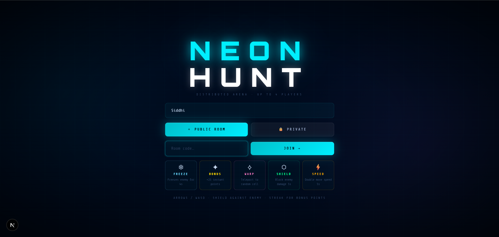
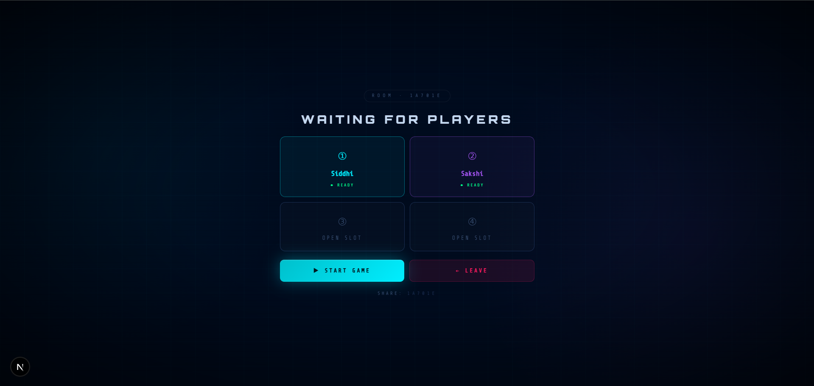
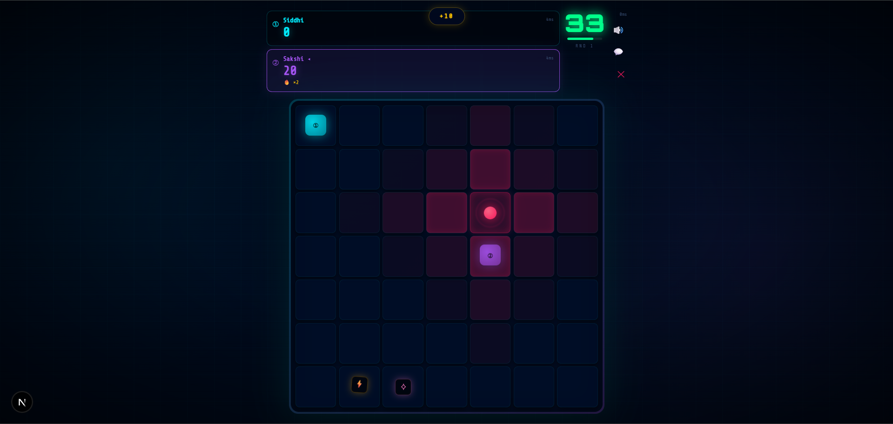
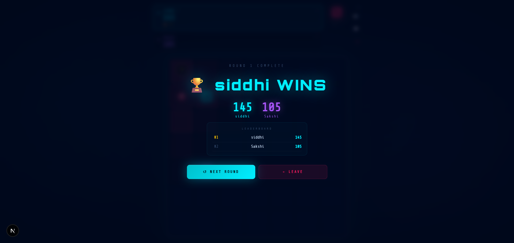

# Neon Hunt - Multiplayer Cyberpunk Arena

---

## Overview

**Neon Hunt** is a real-time multiplayer cyberpunk arena game built using **Next.js, Socket.io, and TypeScript**.

It delivers a **low-latency, server-authoritative multiplayer experience** with:

- Synchronized gameplay  
- Real-time movement  
- Competitive scoring system  
- Room-based matchmaking  

---

## Deployment

-  Live Demo: https://multiplayer-neon-hunt.vercel.app/  
- GitHub Repository: https://github.com/siddhipawar424/multiplayer-neon-hunt  

---

## UI Preview

### Landing Screen  

### Player Setup  

### Gameplay Arena  

### Results Screen  

---

## Features

- Real-time multiplayer gameplay (Socket.io)  
- Server-authoritative game logic  
- Room-based matchmaking system  
- Smooth movement system  
- Live leaderboard & scoring  
- Power-ups (freeze, speed, shield, etc.)  
- In-game chat system  
- Mobile-friendly controls  
- Procedural sound engine  
- Cyberpunk neon UI with animations  

---

## Tech Stack

- Next.js (App Router)  
- React.js  
- TypeScript  
- Socket.io (WebSockets)  
- Node.js + Express.js  
- Tailwind CSS  
- Framer Motion  

---

## How It Works

1. Player joins or creates a room  
2. Server assigns player slot  
3. Game state sync starts  
4. Real-time movement via WebSockets  
5. Server validates all actions  
6. State broadcast to all clients  
7. Winner calculated from final score  

---

## Highlights

- Real-time distributed architecture  
- Server-controlled gameplay loop  
- Low-latency multiplayer sync  
- Modular game engine design  
- Scalable room-based system  

---

## Author

**Siddhi Pawar**

---

## Support

If you like this project, give it a ⭐ on GitHub.
